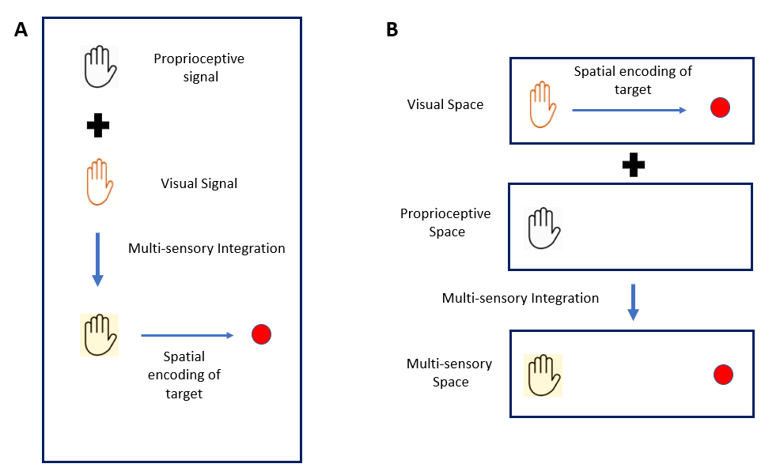

# peripersonal-space
> A virtual reality based investigation into how visuo-proprioceptive integration mechanisms play a role which representing location of a reach action target!

**MS(Research) Thesis** | Rasika Lokhande | IIT Kanpur | Cognitive Science | 2023  
**Supervisor:** Prof. Devpriya Kumar

## 📄 Thesis Title
Spatial encoding of reach action target: An investigation into its body-part centric multi-sensory integration mechanism

## 🎯 Research Questions
1. Is spatial information of reach targets encoded relative to proximally located body parts, even when that body part isn't performing the reach?
2. How does visuo-proprioceptive integration of the proximal body part contribute to target spatial encoding?

## 🏷️ Keywords
`peri-personal-space` `spatial-cognition` `multi-sensory-integration` `body-schema` `VR-experiments` `cognitive-science` `motor-control`

## 📋 Abstract
One of the fundamental human abilities involved in human-environment interaction is extending one’s arm to make physical contact with an object. To perform a successful reaching action, the agent’s cognitive system must encode the spatial location of the target. Peri-personal space is the region of space surrounding the agent’s body where reach targets are located. One of the characteristics of peri-personal space is that the objects in this region of space are encoded with respect to the region of the body-surface that is in close proximity to the object. In addition, action-relevant body parameters, such as the position and structure of the limbs, are encoded in a body representation which is constructed by integrating visual and proprioceptive sensory information about the body.

Considering the above, this thesis investigates the following two questions. Firstly, is the spatial information of the reach target encoded relative to the body part located proximally, even if that body part is not the effector performing the reach action? Secondly, if the answer to the first question is affirmative, how does the integration of visuo-proprioceptive signals regarding the proximal body part contribute to the spatial encoding of the target?

To investigate these questions, two experiments were conducted in an immersive virtual reality set-up, in which a reach task was performed while the action hand was rendered invisible. Visual and proprioceptive information of the proximal body part was manipulated as the experimental conditions, and the accuracy of reaches was measured. The results of the two experiments indicate that the spatial encoding of the reach target occurs relative to the proximal body-part, and that the integration of the proximal body-part’s visual and proprioceptive sensory signals underlies the spatial encoding of the reach target’s location. However, the results further suggest that the spatial encoding of the target occurs relative to the body-part location indicated by its visual signal, as opposed to the body-part position inferred after the integration of multi-sensory signals.

Fig: Two hypothesis regarding spatial encoding of the reach target. In A), the filled hand denotes the hand position inferred from the multi-sensory integration of visual and proprioceptive uni-sensory signals. The target’s spatial location is encoded relative to this inferred hand position. In B), The target’s spatial location is encoded relative to the visual signal in the visual space. The visual space is then integrated with the proprioceptive space to construct a multi-sensory representation of body-schema and surrounding peri-personal space.

